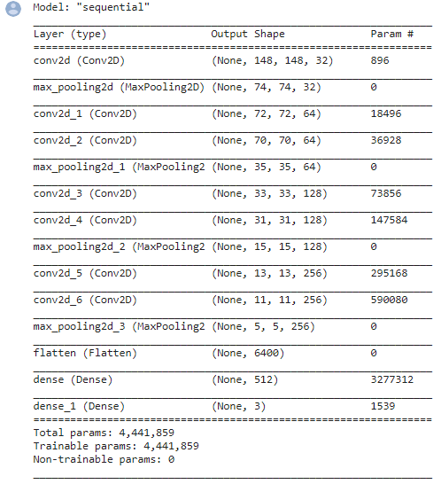
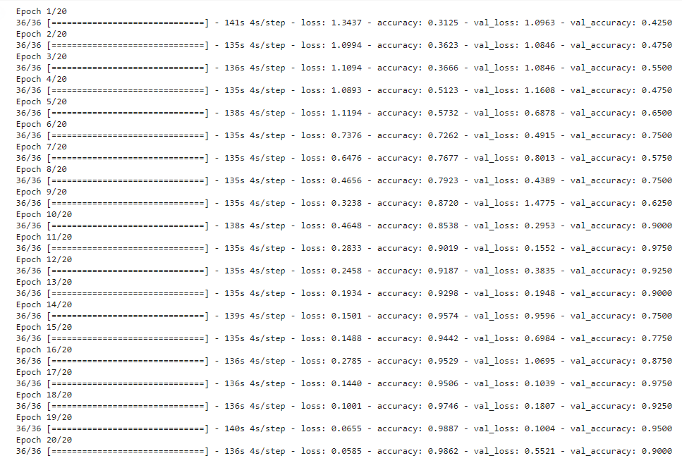
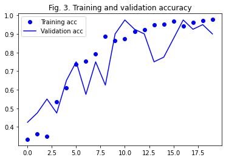
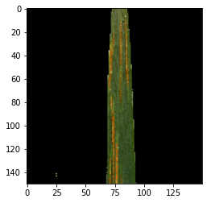
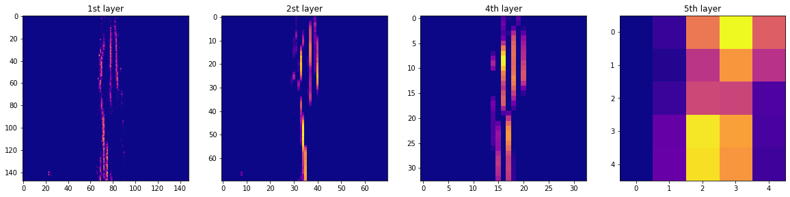
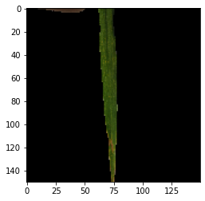
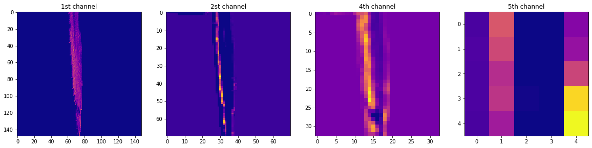
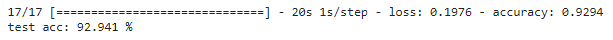

# Classifying wheat leaf disease using convolutional neural networks

### Table of Contents

1.   Background
2.   Methods
3.   Results
4.   Discussion
5.   Literature

### 1. Background
Wheat is a staple food of mankind with 765 million tonnes produced in 2019 (FAOSTAT). Accounting for a fifth of humanity’s food, wheat is second only to rice which provides 21% of the food calories and 20% of the protein for more than 4.5 billion people in 94 developing countries (Braun et al., 2010). 
<i>Puccina triticina</i> is a fungal disease of affecting a range of crops but most notably wheat crops worldwide. Also known as brown leaf rust it is widely recognised a one of the most important diseases, causing around 4% in yield reduction worldwide (Dulleiller et al., 2007) but reductions in up to 50% have been recorded (Draz et al, 2015). While leaf rusts have a complex lifecycle with both sexual and asexual reproduction as well as multiple hosts it is beyong the scope of this analysis. Importantly it occurs on the leaf blade with infections appearing as small round pustules with an orange, brown colour surrounded by a yellow ring of chlorotic leaf tissue, these very identifiable pustules contain the spores.
There are 2 main methods of controlling brown rust in fields, resistant varieties, and chemical sprays. The use of resistant varieties is much more in line with the rational of modern farming techniques. The main issue with resistant varieties is the appearance of new strains that can infect previously resist varieties. To combat this there are fungicides on the market that do offer control, but it is important to ensure that their effectiveness is not impacted.

To try and protect both cultural and chemicals controls effectiveness, it is key to utilise the pillars of Integrated Pest Management (IPM). This can be better achieved with the use of modern technologies such as precision agriculture. The rise of precision agriculture has allowed farming to gather more detailed data on smaller and smaller areas as well as machines more capable take full advantage of such systems.

Accurate automated high-throughput phenotyping of plant diseases has the potential to aid crop management, speed up breeding, and contribute to fundamental and applied research efforts (Pauli et al, 2016). With companies like the small robot company (link can be found [here](https://www.smallrobotcompany.com/)) being developed one could envision small mapping robots being used to travel the fields, identify high disease areas, and highlight these regions for chemical control. A system like this would allow for improved diagnosis and better use of chemical fungicides as well as removing the subjective nature from resistance scoring in crop trials (Bock et al. 2009).

While a system such as this may be seen in the future, there are several challenges for both the hardware and software to overcome. One such challenge is reliably distinguishing between a diseased plant and other forms of damage (DeChant et al. 2017). Image based identification is the best way to approach such a problem, by using Convolutional Neural Networks (CNN) to extract useful features from images without needing manual feature engineering. Using a CNN to correctly identify the presence of a leaf rust infection on the surface of a leaf when only comparing it to perfectly healthy leaves would be very simple, but not very practical as any discolouring of the leaf could lead to an incorrect identification.

To add a layer of practicality a third class is included in the data, leaves that are nitrogen deficient. Nitrogen deficiency is the most common nutrient deficiency and results in paler green leaves with yellowing at the leaf tip reducing grain yield. On a model such as this with such a small dataset overfitting will be the biggest problem to overcome.

The objectives of this analysis were to create a convoltional neural network capable of identifying disease, tune the model for highest levels of accuracy and examine what the deep learning model is using for classifaction i.e., the leaf rust pustules or something less expected. With the overarching aim of this analysis is to correctly identify images of wheat leaves infected with leaf rust, leaves suffering with a nitrogen deficiency and leaves that are perfectly healthy.

### Data 

   *Fig. 1. Sample Images*

The data for this analysis consists of 1459 images of wheat leaves, split into 2 subsets Nitrogen Deficient (abiotic stress) and Rust (biotic stress) and further split outlined in Fig. 2. below (the number of images in each subset). 
The data was collected with an RGB camera from a wheat crop sown in the winter 2019 and harvested in 2020, the fields were a part of the Indian Agriculture Research Institute. The leaf images were acquired at the booting stage of a wheat crop. After the pictures were taken, the images were segmented from the background using Otsu-based masking (Arya et al. 2020).

The files for this analysis can be found at this [link.](https://data.mendeley.com/datasets/th422bg4yd/1). 

Fig. 2.
| Nitrogen Deficient | Rust         |
|--------------------|--------------|
| **Train:**         |              |
| N deficient (209)  | Rust (258)   |
| Control (209)      | Control(258) |
| **Test:**          |              |
| N deficient (44)   | Rust (54)    |
| Control (44)       | Control (73) |
| **Validation:**    |              |
| N deficient (44)   | Rust (54)    |
| Control (44)       | Control(73)  |

### 2. Methods 

Setting up the directories

The files for this analysis were organised rather awkwardly, 2 seperate folders with 12 subfolders 6 of which are for control images. To reduce the complexity, the directories were set up to include all files in a single folder divided according to train, test and validation. This creates and organises the directories before filling them with the appropriate files. Google drive is used to store the images and redistibute the files between various repositories. 

From the table in Fig 2. there is an imbalance in the number of samples in each class, almost half of all images are in the control class. Including all images in the model led to problems with accuracy and noise. By not including the images in one of the control folders it resulted in a more accurate consistant model. 

A link to a notebook where all images are ran through the model is attached [here.](https://github.com/alexdoyle115/C7082_Assignment/blob/main/All_images_and_augmentation_included.ipynb)

####2.1 Convoltional Neural Network

The neural network in this analysis is a basic covenet using alternating layers of
<ul> 
<li>Conv2D - learns local patterns </li>
<li>Maxpooling - Extracting windows from the input feature map and outputting the max value in each channel </li>
<li>Dense - learns global patterns in their feature input space</li>
</ul>

The model is based off the convolutional neural network used to classify cat and dog images in "Deep Learning with Python" (Chollet, 2018), the binary classification problem uses hidden layers alternating between Conv2D and Maxpooling to identify local patterns such as edges, with dense layers to identify these local patterns. The main difference between my model and the dog and cat one is that the dog and cat one uses binary classification by utilizing the sigmoid activation. To correctly identify the 3 different classes (Nitrogen Deficient, Leaf Rust and Healthy) the 'SoftMax' activation is used with 3 classes. (Chollet, 2017).  

  *Fig. 3. CNN Model Structure*

Looking at the model summary we see the vaious layers along with depth and size of the feature maps. The feature size (148x148) is somewhat arbitrary and is decreasing though the max pooling layers while the feature depth starts at 32 increasing to 128 before flattening. In 'Deep learning with Python' it highlights that 'rmsprop' is a suitable optimizer for most applications as it reduces the decay of the learning rate (Lakshmi & Zhou, 2000) and breaks down the appropriate last-layer activation (for multiclass, single label classification the softmax activation and categorical_crossenthropy as the loss function) (Challet, 2017).

#### Image Preprocessing
Using keras's `prepossing.image` packages it automatically converts the jpeg files from a RGB grid of pixels into tensors that are rescaled to be between 0 and 1 which works better in neural networks. 
The images are broken up into batches of 20 tensors. The 20 images are resized to 150 by 150 which is arbitrary but important to keep consistant images fed into the model. As the images are colour, individual tensors are created for the each of the red, green, blue colour layers resulting in 3 different tensors in the input.  The resulting rezised images are fed in the batchs of 20 into the model which accounts for 1 step in the epoch. This processing produces batches in the shape (`20, 150, 150, 3`). To check the images is in the correct class labels are created, as it is a classification problem into 3 classes it requires 3 different labels resultuing in batches of (`20, 3`). 

#### Running the model
Once the data is in a suitable format for the model, it is now fit our model using the `model.fit`. The data is being generated in batches of 20 inputs indefinatly, therefore the generator needs to know how many samples to to draw from the generator before declaring an epoch. In this case there are 722 training images, with 20 images per batch, it will take 36 steps to run all images through. 

 *Fig. 4. CNN Model Results*

### 3. Results
By passing the various subsets of images through the neural network it has trained the hidden units in the layers to take a series of numbers and use these numbers to estimate what group each image belongs. The results are plotted by comparing the training data and the validation data. Looking at the training data there is big jumps in the accuracy in the first 4 epochs, but this slows as it approaches 100% accuracy. It never reaches 1:1 prediction accuracy but in the final epoch it results in 97.02% prediction accuracy. Unfortunately, the same cannot be said for the validation accuracy which is much more important. There is an inconsistency with networks ability to correctly predict the model, the erratic highs, and lows of seen in the plot may be caused by the small number of images available. The highest level of accuracy achieved was 97.5% on the 12th epoch the following iterations resulted in a drop off in accuracy which may be contributed to overfitting.

   *Fig. 5. CNN Model Results - Accuracy*

   *Fig. 6. CNN Model Results - Loss*

#### Visulaising what the covnets learn
Visualing the various layers of the convoltional neural network offers insight into what the "black box" that is a neural network is actually picking up on. The `Rust_identifier_1` model that was trained earlier in the analysis is reloaded as well as the `models`package in `keras`. The image below in Fig. 7 which is a leaf infected with stripes of rust. Ideally the model should see some activity in these regions.

  *Fig. 7. Sample Rust Image*

We can see as images is processed through the layers how the detail decreases.

   *Fig. 8. Layer Activations on Rust leaf*

Fig 9 is a similar process with an image that is nitrogen deficent. 

   *Fig. 9. Sample Deficent Image*

   *Fig. 10. Layer Activations on Nitrogen Deficent Leaf*

#### Testing the Accuracy of the model

   *Fig. 11. Test Data set Accuracy*

When diagnosising nitrogen deficiency in wheat it would be hoped that the network would focus on the yellowing of the tips or possibly paler green colour of the leaf. Comparing the activations they indicate that it is picking up on the yellowing near the tips. In both cases the channnels in the first layer do pickup on these regions for each disease and  are identified with subsequent layers highlighting the rust infection or yellowing of the tips. 

We can see the differences in the individual channels as well as between layers. Certain channels appear to pick up on more information in comparision to others Comparing the images in the plot above we can see the output of the model that there is some alternation between layers and what they are highlighting. The first layer identifies the edges of the leaf blade and as the layers increase the amount of information available decreases and starts to become less visually interpretable, but it is increasing the information about the class of the image. 

Running the model on the test data gives a true representation of how well the model has worked. Running it in batches of 10 over 17 steps it results in an accuracy of 92.94%. Fig. 5. and Fig. 6. shows some inconsistency in the validation error. A factor influencing that may be due to the validation step having 40 images available each time. The accuracy may be lowered by slight over fitting which can be seen in Fig. 3. as the validation error apppears to drop as the training error continues to rise.

### 4. Discussion

While the results from the model are not perfect, they are encouraging. The Convoltional Neural Network was able to correctly classify images into 3 groups with an accuracy of over 92% on test data. There is potential for impoving the accuracy with a couple of tweaks and particularly accessing more images. Gathering a larger dataset may improve accuracy but would allow for greater consistency. I tried to gather some pictures of my own to test with the model, unfortunatly leaf rust infections are very rare at this early stage in the crop development. 

A model such as this while very simple it could be built upon, as mentioned before further images to increase accuracy, images of leaves that have not been segmented from the background to make it more practical and the addition of a system to reliably take pictures and run them through the model would offer the option of installing it on a robot. With companies such as the small robot company (link can be found [here](https://www.smallrobotcompany.com/)) we could see a multitude of sensor robots sent into the fields to detect regions of disease through correct identification to allow for more efficent use of fertilizers and fungicides. By removing the human element from the diagnosis it could offer a more consistent picture of the area, this would be particularly useful in work such as resistance scoring in new crop varieties.

### 5.Literature

**Data** -Arya, Sunny; Singh, Biswabiplab (2020), “Wheat nitrogen deficiency and leaf rust image dataset”, Mendeley Data, V1, doi: 10.17632/th422bg4yd.1
 
Bock, C.H., Parker, P.E., Cook, A.Z., Riley, T. and Gottwald, T.R., 2009. Comparison of assessment of citrus canker foliar symptoms by experienced and inexperienced raters. Plant Disease, 93(4), pp.412-424.

Chollet, F., 2017. Deep learning with python, vol. 1. Greenwich, CT: Manning Publications CO.

DeChant, C., Wiesner Hanks, T., Chen, S., Stewart, E.L., Yosinski, J., Gore, M.A., Nelson, R.J. and Lipson, H., 2017. Automated identification of northern leaf blight -infected maize plants from field imagery using deep learning. Phytopathology, 107(11), pp.1426-1432.

Duveiller, E.,  R. Singh, J. Nicol, The challenges of maintaining wheat productivity: pests, diseases, and potential epidemics, Euphytica, 157 (2007), pp. 417-430

Food and Agriculture Organization of the United Nations (2019). FAOSTAT statistical database (FAO)

Goutam, U., Kukreja, S., Yadav, R., Salaria, N., Thakur, K. and Goyal, A.K., Recent trends and perspectives of molecular markers against fungal diseases in wheat. Frontiers in microbiology, 6 (2015) p.861.

 I.S. Draz, M.S. Abou-Elseoud, A.M. Kamara, O.A. Alaa El-Dein, A.F. EL-Bebany,Screening of wheat genotypes for leaf rust resistance along with grain yield, Ann. Agric. Sci. 60 (2015) 29–39.

Lakshmi, S.M. and Zhou, S., Informix Software Inc, 2000. Optimizer with neural network estimator. U.S. Patent 6,108,648.

Pauli, D., Chapman, S.C., Bart, R., Topp, C.N., Lawrence-Dill, C.J., Poland, J. and Gore, M.A., 2016. The quest for understanding phenotypic variation via integrated approaches in the field environment. Plant Physiology, 172(2), pp.622-634.
